# ESP 设备同时对接 Joylink & Ali-Smartliving

## 目录

1. [介绍](#Introduction)
2. [硬件准备](#hardwareprepare)
3. [平台准备](#Platform_preparation)
4. [环境搭建](#Environment_setup)
5. [SDK 准备](#SDK_preparation)
6. [编译 & 烧写](#Compile_flash)
7. [开发指南](#Development_Guide)
8. [相关链接](#Related_Links)

## <span id = "Introduction">1.介绍</span>

[乐鑫](https://www.espressif.com/zh-hans)是高集成度芯片的设计专家，专注于设计简单灵活、易于制造和部署的解决方案。乐鑫研发和设计 IoT 业内集成度高、性能稳定、功耗低的无线系统级芯片，乐鑫的模组产品集成了自主研发的系统级芯片，因此具备强大的 Wi-Fi 和蓝牙功能，以及出色的射频性能。

[Joylink](https://smartdev.jd.com/) 是京东小京鱼 IoT 开放平台，旨在提供一体化的智能解决方案，小京鱼平台主要服务于生活场景中的智能设备，如智能家居设备，智能家电设备，智能车载，可穿戴设备等。[生活物联网平台 SDK ](https://code.aliyun.com/living_platform/ali-smartliving-device-sdk-c.git)是阿里云 IoT 针对生活物联网平台所提供的设备端 SDK，用于实现与阿里云 IoT 平台通信以及其它的辅助功能（例如 WiFi 配网、本地控制等）。

本项目基于乐鑫 ESP 开发板，用于实现以上两个不同的云平台控制同一设备。

## <span id = "hardwareprepare">2.硬件准备</span>

- **linux 环境**
  用来编译 & 烧写 & 运行等操作的必须环境。

> windows 用户可安装虚拟机，在虚拟机中安装 linux。

- **ESP 设备**
  ESP 设备包括 [ESP芯片](https://www.espressif.com/zh-hans/products/hardware/socs)，[ESP模组](https://www.espressif.com/zh-hans/products/hardware/modules)，[ESP开发板](https://www.espressif.com/zh-hans/products/hardware/development-boards)等。
- **USB 线**
  连接 PC 和 ESP 设备，用来烧写/下载程序，查看 log 等。

## <span id = "Platform_preparation">3.平台准备</span>

Joylink 云平台准备：用户可通过在[小京鱼平台](http://smartdev.jd.com/)创建自己的设备，以获取设备连接云端的`uuid`, `private key`, `public key`, `device MAC`。

Ali-Smartliving 云平台准备：根据[生活物联网平台官方文档](https://help.aliyun.com/document_detail/126404.html?spm=a2c4g.11186623.6.562.4df61fd8UYppkg)，在生活物联网平台创建产品，创建设备，同时自动产生 `product key`, `product secert`, `device name`, `device secret`。

### 阿里云平台部署

在阿里云 [生活物联网平台](https://living.aliyun.com/#/) 创建产品，参考[创建产品文档](https://living.aliyun.com/doc#readygo.html)。

> 配置较多，如果不太懂，也不用纠结，后续都可以修改。

部署自己的产品，可参考如下: 新增 RGB 调色功能:

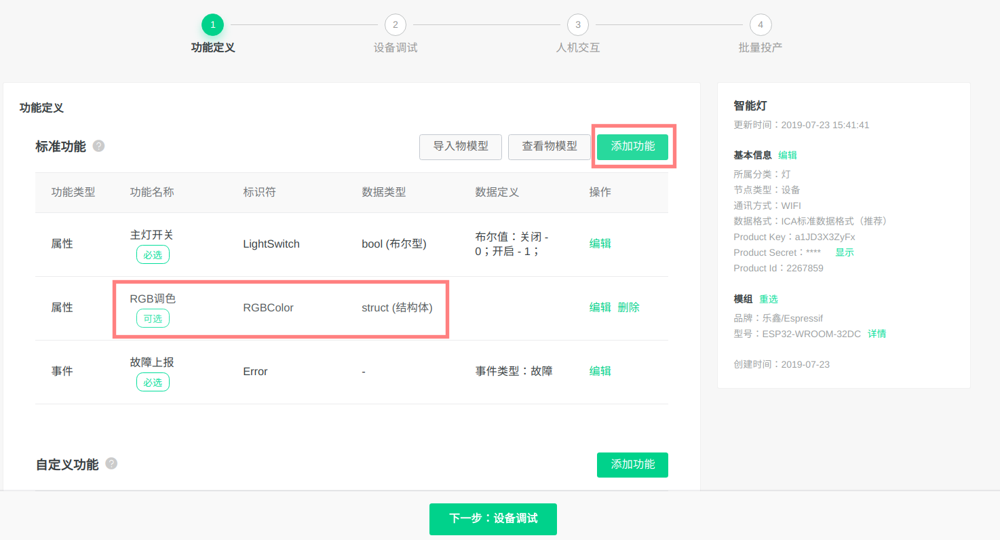

新增测试设备，此处即可以获得`三元组`，后续需要烧录到 NVS 分区. 

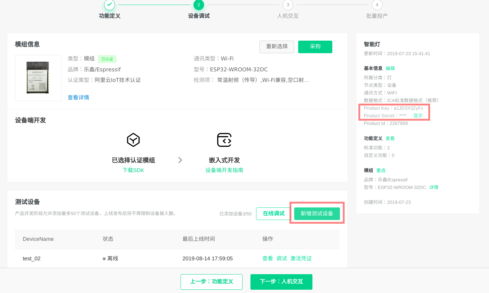

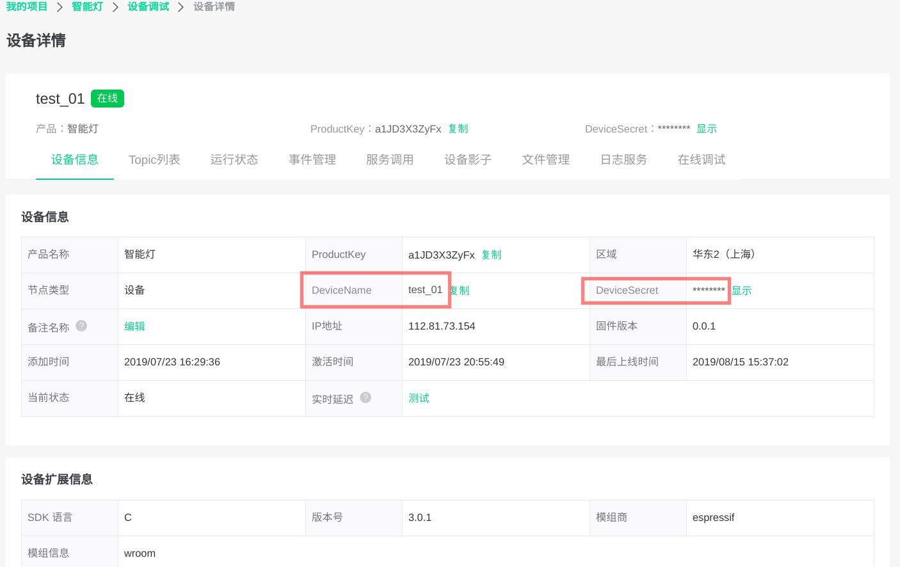

选择面板，手机 APP 上会显示同样界面; `配网二维码`是贴在产品包装上，终端客户给设备 Ali-Smartliving 配网中需扫描此二维码。

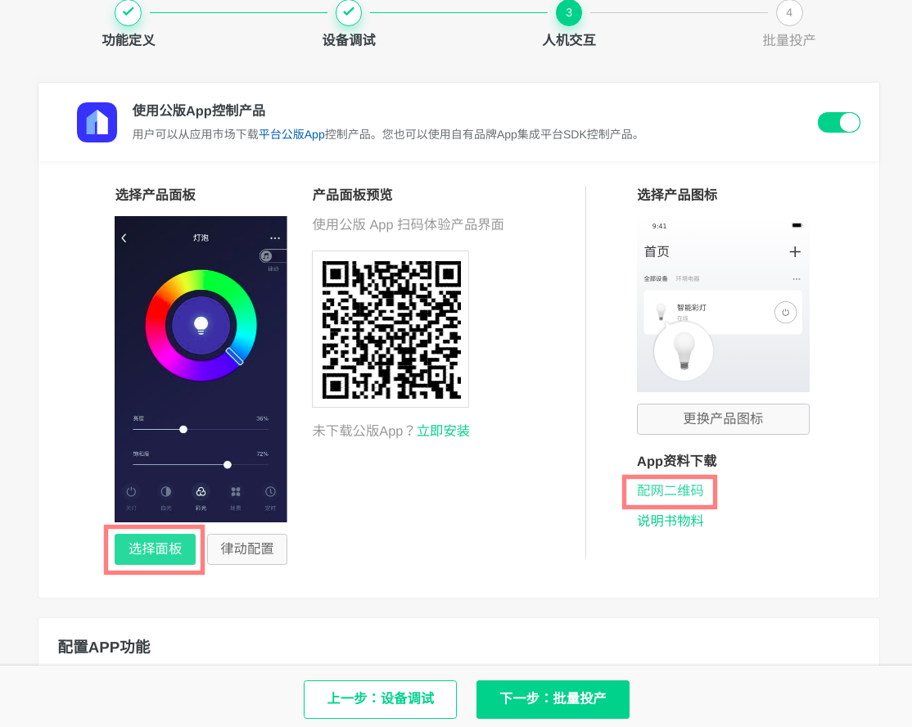

选择面板时，主题面板在手机上仅能显示标准界面，没有 RGB 调色功能。可以自定义面板，增加 RGB 调色。

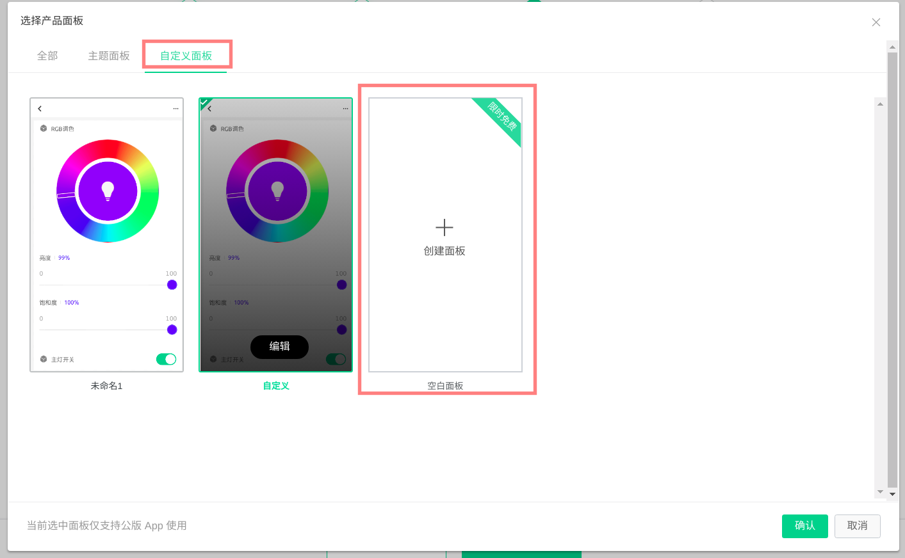

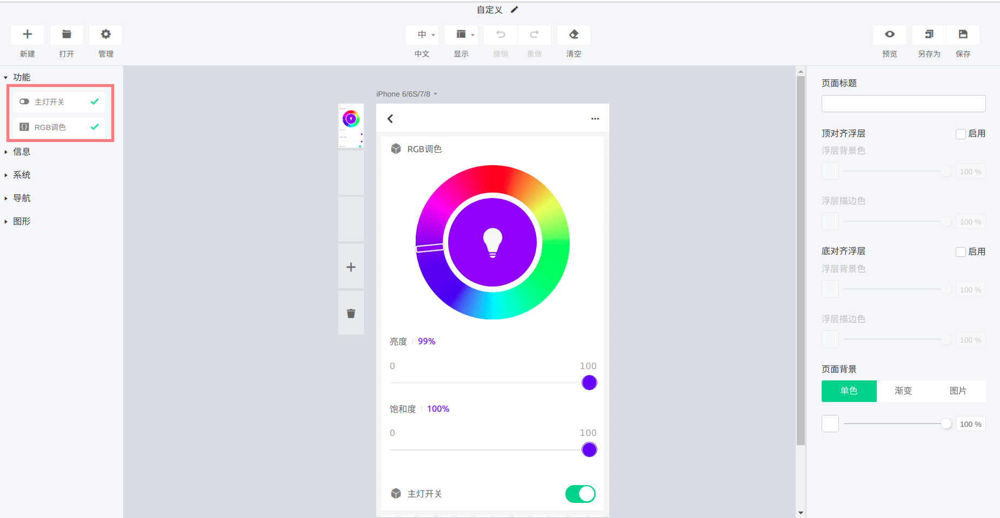

配网方案选择: 

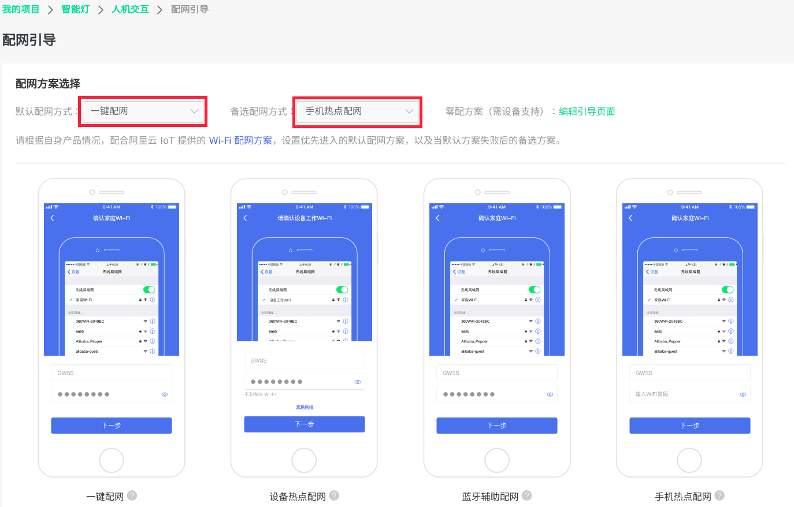

完成 

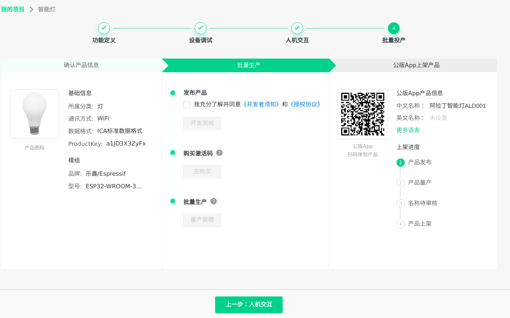

同时用户还需在移动设备端安装 [小京鱼 APP](https://smartdev.jd.com/docCenterDownload/list/2) 以及 [云智能 APP](https://help.aliyun.com/document_detail/125620.html?spm=a2c4g.11186623.6.565.16f46f67XEEN1k)

## <span id ="Environment_setup">4.环境搭建</span>

**如果您熟悉 ESP 开发环境，可以很顺利理解下面步骤; 如果您不熟悉某个部分，比如编译，烧录，需要您结合官方的相关文档来理解。如您需阅读 [ESP-IDF 编程指南](https://docs.espressif.com/projects/esp-idf/zh_CN/v4.2/index.html)文档等。**

### 4.1 编译器环境搭建

- ESP8266 平台: 根据[官方链接](https://github.com/espressif/ESP8266_RTOS_SDK)中 **Get toolchain**，获取 toolchain
- ESP32 & ESP32S2 平台：根据[官方链接](https://github.com/espressif/esp-idf/blob/master/docs/zh_CN/get-started/linux-setup.rst)中 **工具链的设置**，下载 toolchain

toolchain 设置参考 [ESP-IDF 编程指南](https://docs.espressif.com/projects/esp-idf/zh_CN/v4.2/get-started/index.html)。

### 4.2 烧录工具/下载工具获取

- ESP8266 平台：烧录工具位于 [ESP8266_RTOS_SDK](https://github.com/espressif/ESP8266_RTOS_SDK#get-toolchain) 下 `./components/esptool_py/esptool/esptool.py`
- ESP32 & ESP32S2 平台：烧录工具位于 [esp-idf](https://github.com/espressif/esp-idf) 下 `./components/esptool_py/esptool/esptool.py`

esptool 功能参考:

```
$ ./components/esptool_py/esptool/esptool.py --help
```

## <span id = "SDK_preparation">5.SDK准备</span>

- ESP32 & ESP32S2 平台: [ESP-IDF](https://github.com/espressif/esp-idf)
- ESP8266 平台: [ESP8266_RTOS_SDK](https://github.com/espressif/ESP8266_RTOS_SDK)

> ESP8266 平台，推荐使用 ESP8266_RTOS_SDK (master) Commit_ID: a768f1c
>
> ESP32 平台， 需使用 ESP-IDF v4.0 及之后的版本，推荐使用 ESP-IDF v4.0 和 v4.2
>
> ESP32-S2 平台，需使用 ESP-IDF v4.2 及之后的版本，推荐使用 ESP-IDF v4.2

## <span id = "Compile_flash">6.编译 & 烧写</span>

### 6.1 编译

#### 6.1.1 导出编译器

参考 [工具链的设置](https://docs.espressif.com/projects/esp-idf/zh_CN/v4.2/get-started/linux-setup.html)

#### 6.1.2 编译 ali-smartliving-device-sdk-c 库

在 `esp-dual-clouds -> components -> esp-ali-smartliving` 目录下执行：

```
cd ali-smartliving-device-sdk-c
make reconfig (选择SDK平台)
make menuconfig (选择相关功能配置,默认不需要修改,该步骤可以省略)
make (生成相关头文件和库文件)
```

#### 6.1.3 编译 demo 示例

在 `esp-dual-clouds` 目录下执行：

```
cd examples/dual-cloud-demo
make defconfig
make menuconfig
```

如果需要编译esp32s2版本, 请按照如下步骤编译: 执行如下命令：

```
cd examples/dual-cloud-demo
idf.py set-target esp32s2
idf.py menuconfig
```

如果使用 cmake 编译 esp32，不需要 set-target。

在 menuconfig 里面配置 joylink 相关参数 `UUID`，`CID`，`PID`， `PUBLIC_KEY`，`PRIVATE_KEY`，`MAC_ADDRESS`

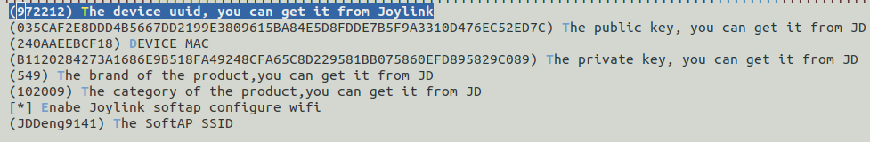

其中 `UUID`、`CID` 和 `PID` 分别代表产品的唯一标识码、品类和品牌，在云端产品中的位置如下

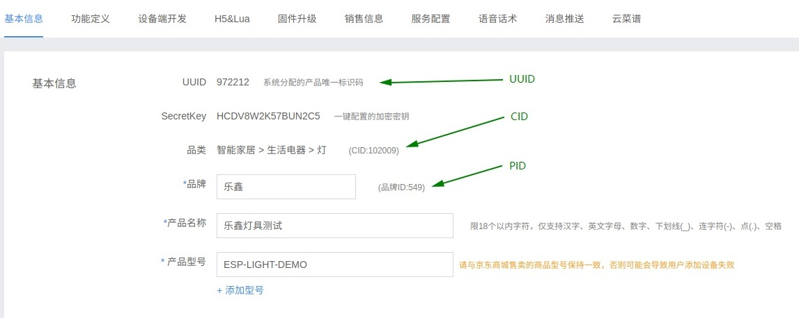

`PUBLIC_KEY `为产品公钥，显示在设备端开发页面，设备认证采用一机一密的方式 ，用户需导入 `MAC_ADDRESS` (设备 MAC 地址) 来生成 `PRIVATE_KEY` (设备私钥) ，具体生成方式请在设备端开发页面点击 “导入 MAC 地址生成私钥” 选项并按提示进行。

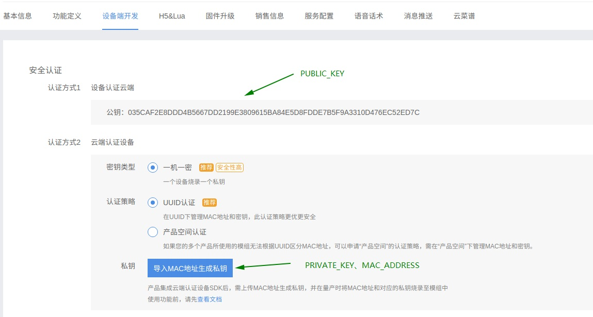

#### 6.1.4配置烧写串口

生成最终 bin

```
make -j8
```

使用 esp32s2 生成 bin

```
idf.py build
```

### 6.2 擦除 & 编译烧写 & 下载固件

将 USB 线连接好 ESP 设备和 PC，确保烧写端口正确。

如果没有安装串口驱动，需要先安装[串口驱动](http://www.usb-drivers.org/ft232r-usb-uart-driver.html)。

#### 6.2.1[可选] 擦除 flash

```
make erase_flash
```

使用 esp32s2 擦除 flash

```
idf.py -p (PORT) erase_flash
```

> 注：无需每次擦除，擦除后需要重做 6.2.3。

#### 6.2.2 烧录程序

```
make flash
```

使用 esp32s2 烧录程序

```
idf.py -p (PORT) flash
```

#### <span id = "mass">6.2.3 烧录三元组信息</span>

参考 [量产说明](./config/mass_mfg/README.md) 文档烧录三元组 NVS 分区。

## <span id = "Development_Guide">7.开发指南</span>

### 7.1 文件结构

```
.
├── docs
│   ├── md                                   // md files
│   │   └── size-component.md
│   ├── _picture
│   └── 双云8266内存使用情况-master.xlsx
│
├── config                                   
│   └── mass_mfg                             // Triple information of Ali-Smartlivng
│       ├── multipule_mfg_config.csv
│       ├── multipule_mfg_values.csv
│       ├── single_mfg_config.csv
|       └── README.md
│   
├── examples
│   ├── joylink 
│   ├── ali-smartliving  
│   └── dual-cloud-demo                      // dual-clouds-demo light_demo
│       ├── CMakeLists.txt
│       ├── default_configs                           
│       ├── main
│       ├── README.md
│       ├── Makefile
│       └── components
│           ├── ali_smartliving_extern
│           ├── joylink_extern
│           ├── conn_mgr
│           ├── lightbulb
│           └── button
│   
├── components                 
│   ├── esp-joylink                          // joylink SDK
│   |	├── CMakeLists.txt
│   |	├── components.mk
│   |	├── joylink_dev_sdk
│   |	|   ├── ble_sdk
│   |	|   ├── example
│   |	|   ├── joylink
│   |	|   ├── lua
│   |	|   ├── Makefile
│   |	|   ├── pal
│   |	|   ├── README
│   |	|   └── scripts
|   |	└── port
│   |       ├── include
│   |       ├── joylink_ble.c
│   |       └── joylink_upgrade.c
│   └── esp-ali-smartliving                  //Ali-Smartliving SDK
│   	├── CMakeLists.txt
│   	├── components.mk
│   	├── ali-smartliving-device-sdl-c
|       └── wrappers
│     
├── Kconfig
│
└── README.md
```

### 7.2 参数配置

- Joylink 产品信息配置
  在 `memuconfig` 中， 用户可以修改以下这些参数，如 AES_KEY, UUID, PID等，系统会调用 `joylink_dev_init()` 传入产品注册的信息，注册事件回调函数。用户如果需要修改为自己的设备，首先需要在京东开发者中心上申请自己的设备，并根据相应设备信息在此处修改。
  因为这些参数需要在服务器后台产品基本信息里获取，或者向京东有关部门咨询。
- Ali-Smartliving 产品相关三元组信息需通过写入 CSV 文件的方法烧录至 NVS 分区，具体可以参考 [6.2.3](#mass) 。

### 7.3 配网

京东配网方式目前主推 SoftAP，设备启动后，用户需使用热点配网的方式通过小京鱼 APP 为设备配网，待设备配网并连接 Joylink 云端后（约30s），设备主动去连接 Ali 云端，连接 Ali 云端成功后，用户可通过云智能 APP `自动发现`功能来发现设备并添加至自己的列表中。

若用户暂时无法使用小京鱼 APP 为设备配网，用户可以在设备等待配网连接时短按 boot 按键来切换配网模式，此时设备将切换至 Ali 一键配网模式，用户可通过云智能 APP 来为设备进行配网。

## <span id = "Related_Links">8. 相关链接</span>

- Espressif 官网： [http://espressif.com](http://espressif.com/)
- ESP32 SDK 下载： https://github.com/espressif/esp-idf
- ESP8266 SDK 下载： https://github.com/espressif/ESP8266_RTOS_SDK
- 烧录工具：http://espressif.com/en/support/download/other-tools
- 京东微联官网：[https://smartcloud.jd.com](https://smartcloud.jd.com/)
- 官方JoyLink协议SDK： https://storage.jd.com/testsmartcloud/joylink_dev_sdk.zip
- 设备入网的协议文档： https://storage.jd.com/testsmartcloud/JoylinkConfigDoc.zip
- 生活物联网平台：https://living.aliyun.com/

