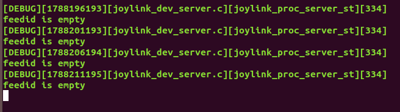
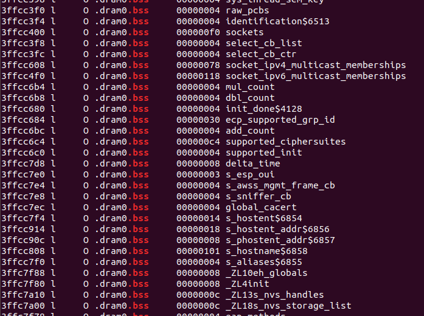

# ESP-Dual-Clouds  项目总结

## 1. 项目概述

ESP-Dual-Clouds 基于乐鑫研发的芯片，依托 Joylink 和 Ali-Smartliving 两大云平台，提供一种设备同时连接两个云平台的解决方案，用户可以通过 Joylink 和 Ali-Smartliving 这两个智能云平台对同一设备进行控制；客户也可根据自己的需求进行二次开发，实现更加丰富的控制操作。

目前该解决方案已在 ESP8266 ESP32 ESP32S2 上实现。

## 2. 项目开发环境

|                            开发板                            | [ESP8266_RTOS_SDK](https://github.com/espressif/ESP8266_RTOS_SDK) 版本 | [ESP-IDF](https://github.com/espressif/esp-idf) 版本  |
| :----------------------------------------------------------: | :----------------------------------------------------------: | :---------------------------------------------------: |
| [ESP8266-DevKitC](https://www.espressif.com/sites/default/files/documentation/ESP8266-DevKitC_getting_started_guide__EN.pdf) |                 master (commit id : 7f99618)                 |                          --                           |
| [ESP32-DevKitC](http://espressif.com/en/products/hardware/esp32-devkitc/overview) |                              --                              | v4.0 (commit id : 5630b17)  v4.2 (commit id : 2532dd) |
| [ESP32-S2-Saola-1](https://docs.espressif.com/projects/esp-idf/en/latest/esp32s2/hw-reference/esp32s2/user-guide-saola-1-v1.2.html) |                              --                              |               v4.2 (commit id : 2532dd)               |

## 3. 内存测试数据

以下测试数据均基于 ESP8266-DevKitC 开发板，ESP8266_RTOS_SDK master 分支 (commit id : 7f99618)

### 3.1 单独运行 joylink

|       过程        | free_heap_size | minimum_free_heap_size |
| :---------------: | :------------: | :--------------------: |
|   进入app_main    |     82464      |         79136          |
| nvs、wifi初始化后 |     54672      |         52876          |
|      配网前       |     54784      |         52876          |
|      配网后       |     53484      |         45980          |
|     连接云前      |     48320      |         45980          |
|     连接云后      |     41652      |         18764          |

### 3.2 单独运行 Ali-Smartliving

| 条件（ali 指定 wifi 联网） | free_heap_size | minimum_free_heap_size |
| :------------------------: | :------------: | :--------------------: |
|        进入app_main        |     95276      |         92192          |
|     nvs、wifi初始化后      |     68024      |         66240          |
|           配网前           |     66708      |         64924          |
|           配网后           |     66612      |         64468          |
|          连接云前          |     59708      |         58096          |
|          连接云后          |     40000      |         28356          |

### 3.3 运行双云

|                过程                | free_heap_size | minimum_free_heap_size |
| :--------------------------------: | :------------: | :--------------------: |
|            进入app_main            |     79772      |         76688          |
|         nvs、wifi初始化后          |     51196      |         49428          |
|               配网后               |     50008      |         42524          |
| 创建完 joylink_main_task (1024*11) |     38548      |         36948          |
|          joylink 连接成功          |     28900      |          8680          |
|      ali-smartliving连接成功       |     16860      |          2320          |

>具体数据以及以上三种情况的静态内存开销可参考 [双云8266内存使用情况](../双云8266内存使用情况 -master.xlsx) 和 [size-component](./size-component.md)

## 4. 项目中遇到的问题

### 4.1 Ali-Smartliving 配网问题

Ali-Smartliving 默认使用一键配网，不过也可以调用 `conn_mgr_set_sc_mode(CONN_SOFTAP_MODE)` 设置为热点配网

**何为一键配网**

- 手机连接到WiFi热点上, 然后在固定的信道上广播发送被特殊编码的SSID/密码的编码字节
- 设备轮询所有的WiFi信道去检测是否有配网通告, 如果检测到则从配网通告中解码出WiFi热点的SSID/密码


**何为热点配网**

- 设备开启默认热点, 手机搜索发现到热点后连接到设备热点, 

- 手机将连接公网的路由器热点的SSID/密码(AES加密)发送给WiFi设备, 然后WiFi设备就使用手机发送过来的SSID/密码(AES解密)连接路由器


### 4.2 设备连接上提前写入 Wi-Fi 信息的路由后直接连接云端

**Joylink**

不使用热点配网，而是使设备连接上提前写入 Wi-Fi 信息的路由，此时设备可以获取到路由分配的 ip ，但是在连接 Joylink 云端时会产生 error 。

原因：首次连接 Joylink 云端的设备必须要有一个激活过程，而该激活过程中云端下发给设备的 `feedid` `accesskey` `localkey` 等设备激活信息是连接云端的先决条件，这些信息会在激活过程中保存在设备 NVS 中，以便下次启动时可以直接连接至 Joylink 云端。

如果设备未激活前使设备连接上提前写入 Wi-Fi 信息的路由，直接连接路由不会触发激活过程，故 Joylink SDK 主循环处理函数找不到设备激活信息，便会产生 error。



**Ali-Smartliving**

不使用热点配网或一键配网，使设备连接上提前写入 Wi-Fi 信息的路由，此时设备可以获取到路由分配的 ip ，并顺利连接至 Ali-Smartliving 云端。

>注意一定要提前烧录设备三元组信息至 NVS 分区，否则在连接云端时就会出错

### 4.3 mbedTLS 优化

前期使用 8266 运行双云时会出现内存不足，后面使用 ESP8266_RTOS_SDK master 分支，并在 `menuconfig -> mbedTLS` 中打开  `Using dynamic TX/RX buffer`，内存剩余有所改善。

### 4.4 ESP8266_RTOS_SDK master 编译 Ali-Smartliving ，会出现 error

如果使用 ESP8266_RTOS_SDK master 编译 Ali-Smartliving ，会出现错误。

原因：对于 ESP8266，Ali-Smartliving 默认 sdkconfig 是选择使用 wolfSSL，而 ESP8266_RTOS_SDK master 不再支持 wolfSSL，所以需要在 `menuconfig -> ESP-TLS` 选择 `mbedTLS` 作为 TLS Library。

### 4.5 云智能 APP 版本问题

云智能 APP 目前仅在开发版上支持自动发现功能，若是非开发版本，手机 APP 暂时搜索不到已连接 Ali-Smartliving 设备。

### 4.6 Ali-Smartliving 配网，用户添加设备失败问题

在同一环境下，如果有多个用户同时为不同设备进行 Ali-Smartliving 配网，可能会导致用户均添加设备失败。

### 4.7 热点配网的 SSID 格式问题

Ali-Smartliving 热点配网的 SSID 格式只能是 adh_xxx_xxx，而 Joylink 热点配网的 SSID 只能是 JD 开头。

### 4.8 crash 问题

如果在 Joylink 配网任务删掉之后调用 joylink_softap_status() API 来获取 softap 配网状态，程序将会 crash。

### 4.9 内存优化

#### 4.9.1 Task Stack Size 优化 

使用 uxTaskGetStackHighWaterMark API 来查看任务存在最小的可用堆栈空间，根据返回数据来优化 Task Stack Size

>若需使用 uxTaskGetSystemState() 和 vTaskList() API 来查看更加详细的任务信息，需在 `menuconfig -> FreeRTOS` 中打开 `Enable FreeRTOS trace facility` 和 `Enable FreeRTOS stats formatting functions` 相关选项。

#### 4.9.2 heap 查看

| API                              | 返回值含义                             |
| :------------------------------- | :------------------------------------- |
| esp_get_free_heap_size()         | 当前可用堆内存的大小                   |
| esp_get_minimum_free_heap_size() | 程序执行期间可用的可用堆内存的最小大小 |

>根据查看动态内存数据来判断函数或任务所占用内存大小以及是否被释放

#### 4.9.3 mbedTLS 优化

在连接云端时 TLS 加密将会消耗掉很多内存空间，故在 `menuconfig -> mbedTLS` 中打开  `Using dynamic TX/RX buffer` ，使 mbedTLS 在需要发送数据时分配 TX 缓冲区，然后在发送所有数据时释放它，在需要接收数据时分配 RX 缓冲区，然后在所有数据被上层使用或读取时释放它，这将会节省更多的堆空间。 

#### 4.9.4 静态内存开销查看

在编译完成之后，执行以下指令来获取 project 静态内存开销，包括 .data 、.bss 和每个组件的静态链接库文件

**make**

```
make size               //总静态内存开销
make size-components    //总静态内存开销 + 各个组件静态链接库静态内存开销
make size-files         //总静态内存开销 + 各个链接文件静态内存开销
```

>更多 make 相关命令请参考 [make_targets](./make_targets.md)
>

**Cmake**

```
idf.py size             //总静态内存开销
idf.py size-components  //总静态内存开销 + 各个组件静态链接库静态内存开销
idf.py size-files       //总静态内存开销 + 各个链接文件静态内存开销
```

>更多 idf.py 相关命令请参考 [idf.py_commands](./idf.py_commands.md)

#### 4.9.5 全局变量查看

在编译完成之后，可以通过反汇编 ELF 文件来查看 SYMBOL TABLE，以查找占用较多内存的变量

```
cd build
xtensa-esp32-elf-objdump -t esp-dual-clouds.elf > esp-dual-clouds.S
cat esp-dual-clouds.S | grep .bss
```



之后可以通过以下命令来查看变量所在的静态链接库

```
cat esp-dual-clouds.map | grep xxx
```

#### 4.9.6 Wi-Fi 内存优化

在合理范围内适当减小 WiFi RX buffers' number、WiFi RX buffers' number、WiFi TX packets' number 以及 WIFI_PPT_TASKSTACK_SIZE，以略微牺牲性能的方式换取更多的内存空间。