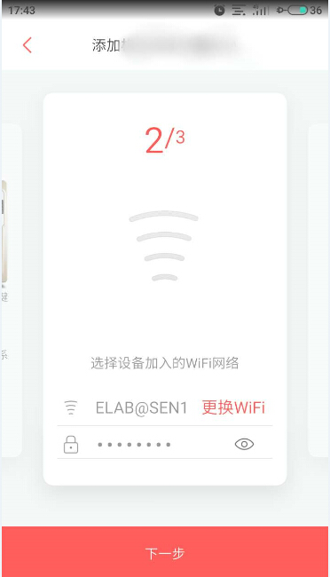

# Dual Clouds of ESP

## 一、介绍

`Dual Clouds`为客户提供一种可同时连接两个云平台的智能灯控制解决方案，客户可以通过 Joylink 和 Ali-Smartliving 这两个智能云平台对同一设备进行控制；客户也可根据自己的需要进行二次开发，实现更加更加丰富的控制操作。

## 二、解决方案部署

**1.参考[README](../../README.md)文档进行硬件准备、平台准备、环境搭建、SDK 准备**

**2.烧录三元组信息**

- 请参考 [量产说明](../../config/mass_mfg/README.md) 文档烧录三元组 NVS 分区.
- 修改 Joylink 有关  `uuid`  `private key`  `public key`  `device mac`  为对应自己设备的信息

> 如果执行了 `make erase_flash`, 需要重新烧录三元组.

**3.编译 ali-smartliving-device-sdk-c 库**

在 `esp-dual-clouds -> components -> esp-ali-smartliving` 目录下执行：

```
cd ali-smartliving-device-sdk-c
make reconfig (选择SDK平台)
make menuconfig (选择相关功能配置,默认不需要修改,该步骤可以省略)
make (生成相关头文件和库文件)
```

**4.编译`dual_cloud_demo`并烧录运行**

对于ESP32平台，请输入如下命令进行编译烧录

```
cd examples/dual_cloud_demo
make build
make flash monitor
```

对于 ESP32S2 平台，请使用如下命令进行编译烧录

```
cd examples/dual_cloud_demo
idf.py set-target esp32s2
idf.py build
idf.py -p /dev/ttyUSBx flash monitor
```

对于ESP8266平台，请使用如下命令进行编译烧录

```
cd examples/light_demo
make -j8 flash monitor
```

## 三、运行

默认使用 Joylink 为设备进行配网，首先用户需通过小京鱼 APP 为设备进行配网操作，待设备添加成功后，设备将会自动连接 Ali-Smartliving 云端，用户可通过云智能 APP 自动发现功能搜索处于同一局域网内的设备并进行添加，随后用户即可通过两个智能云平台分别对智能设备进行控制。

>若已经完成配网，复位设备后用户不需再次配网，设备将会根据上次配网所配置的 Wi-Fi 信息自动连接至 Joylink 以及 Ali-Smartliving。
>
>若用户暂时因为其他原因使用不了小京鱼 APP ，用户可在设备处于配网模式下，短按 boot 按键，即可切换为 Ali-Smartliving 配网模式，用户即可通过云智能 APP 为设备进行一键配网。 

- 扫描二维码

  

- 配网界面

  

- 选择合适的AP进行配网（乐鑫设备仅支持 2.4G AP）

- 等待建立连接

  > 若连接过程中app未发现设备的softAP，则可根据提示进行手动连接至设备的softAP

- 连接服务器成功后用户设备列表中会出现该智能灯设备，点击添加即可

- 手机与设备处于同一局域网下，打开云智能 APP 自动发现功能，等待搜索设备信息，待出现该智能灯设备，点击添加即可

- 用户可通过小京鱼 APP 以及云智能 APP 点击开关、氛围灯或色彩对智能灯设备进行控制

- 若用户想要重新配网，长按 boot 按键 3 秒即可重新进入 Joylink 配网模式

>按键功能
>
>|                         | 功能模式                    |
>| ----------------------- | --------------------------- |
>| **短按 boot 按键**      | 切换配网模式                |
>| **长按 boot 按键 3 秒** | 清除 NVS 分区信息并重启设备 |

## 四、Q & A

### 1.为什么设备在 Joylink 配网之后，云智能 APP 未能发现设备

云智能自动发现功能需点击云智能 APP 首页右上角小加号进入；当手机与设备处于同一局域网之内，APP 才可以正常搜索到设备；若以上条件都满足，仍搜索不到设备，请短按 En 按键复位设备。

### 2.编译时报错

```
/home/espressif/xtensa/xtensa8266-master/xtensa-lx106-elf/bin/../lib/gcc/xtensa-lx106-elf/8.4.0/../../../../xtensa-lx106-elf/bin/ld: /home/espressif/my_store/esp-dual-cloud/components/esp-ali-smartliving/ali-smartliving-device-sdk-c/output/release/lib/libiot_sdk.a(utils_event.o): warning: incompatible Xtensa configuration (ABI does not match)
/home/espressif/xtensa/xtensa8266-master/xtensa-lx106-elf/bin/../lib/gcc/xtensa-lx106-elf/8.4.0/../../../../xtensa-lx106-elf/bin/ld: /home/espressif/my_store/esp-dual-cloud/components/esp-ali-smartliving/ali-smartliving-device-sdk-c/output/release/lib/libiot_sdk.a(sdk-impl.o): warning: incompatible Xtensa configuration (ABI does not match)
/home/espressif/xtensa/xtensa8266-master/xtensa-lx106-elf/bin/../lib/gcc/xtensa-lx106-elf/8.4.0/../../../../xtensa-lx106-elf/bin/ld: /home/espressif/my_store/esp-dual-cloud/components/esp-ali-smartliving/ali-smartliving-device-sdk-c/output/release/lib/libiot_sdk.a(impl_dynreg.o): warning: incompatible Xtensa configuration (ABI does not match)
/home/espressif/xtensa/xtensa8266-master/xtensa-lx106-elf/bin/../lib/gcc/xtensa-lx106-elf/8.4.0/../../../../xtensa-lx106-elf/bin/ld: /home/espressif/my_store/esp-dual-cloud/components/esp-ali-smartliving/ali-smartliving-device-sdk-c/output/release/lib/libiot_sdk.a(dm_api.o): warning: incompatible Xtensa configuration (ABI does not match)
```

未选择对应 SDK 平台编译 ali-smartliving-device-sdk-c 库